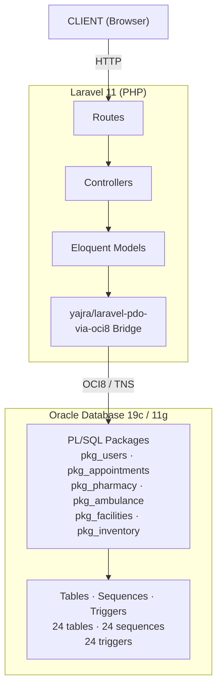

<div align="center">
  <h1>🏥 HelloMed Database Architecture</h1>
  <p><b>A Comprehensive Oracle PL/SQL Schema for Hospital Management</b></p>
  <p><i>24 relational tables · 6 PL/SQL packages · 24 sequences & triggers · Full seed data</i></p>

  [](https://oracle.com)
  [](https://oracle.com)
  [](https://laravel.com)
  [](#)
</div>

<br/>

---

## 📑 Table of Contents

- [About the Database](#-about-the-database)
- [Role-Based Features & Capabilities](#-role-based-features--capabilities)
  - [Public (Unauthenticated)](#public-unauthenticated-visitors)
  - [Patient](#patient)
  - [Doctor](#doctor)
  - [Admin](#admin)
  - [Staff](#staff)
  - [Pharmacist](#pharmacist)
  - [RBAC Access Matrix](#rbac-access-matrix)
- [Schema Architecture Overview](#-schema-architecture-overview)
  - [Domain Modules](#domain-modules)
  - [Complete Table Inventory](#complete-table-inventory)
  - [ER Diagrams](#er-diagrams)
  - [Detailed Schema](#detailed-schema)
- [DBMS: Oracle-Specific Design](#-dbms-oracle-specific-design)
  - [Why Oracle?](#why-oracle)
  - [Version Compatibility](#version-compatibility)
  - [Sequences vs IDENTITY Columns](#sequences-vs-identity-columns)
  - [Timestamp Strategy](#timestamp-strategy)
  - [Privilege Requirements](#privilege-requirements)
  - [Idempotent DDL Strategy](#idempotent-ddl-strategy)
- [Schema Deep Dive](#-schema-deep-dive)
  - [Core & Authentication System](#1-core--authentication-system)
  - [Medical Services & Appointments](#2-medical-services--appointments)
  - [Digital E-Pharmacy](#3-digital-e-pharmacy)
  - [Content CMS & Community Q&A](#4-content-cms--community-qa)
  - [Emergency Dispatch](#5-emergency-dispatch)
- [PL/SQL Packages in Detail](#plsql-packages-in-detail)
  - [pkg_users](#1-pkg_users-03_pkg_userssql)
  - [pkg_appointments](#2-pkg_appointments-04_pkg_appointmentssql)
  - [pkg_pharmacy](#3-pkg_pharmacy-05_pkg_pharmacysql)
  - [pkg_ambulance](#4-pkg_ambulance-06_pkg_ambulancesql)
  - [Package Design Philosophy](#package-design-philosophy)
- [Industry Standards & Design Patterns](#-industry-standards--design-patterns)
  - [Database Normalization](#database-normalization)
  - [Referential Integrity](#referential-integrity)
  - [Audit & Compliance Logging](#audit--compliance-logging)
  - [Soft Deletes & State Machines](#soft-deletes--state-machines)
  - [Legacy Compatibility Patterns](#legacy-compatibility-patterns)
- [Integration: Oracle ↔ Laravel](#-integration-oracle--laravel)
  - [Architecture Diagram](#architecture-diagram)
  - [OCI8 Driver Bridge](#oci8-driver-bridge)
  - [How the Web App Calls PL/SQL](#how-the-web-app-calls-plsql)
  - [Data Flow Example](#data-flow-example)
- [Software & Environment Setup (Windows)](#-software--environment-setup-windows)
  - [Oracle Instant Client Installation](#1-oracle-instant-client-installation)
  - [PHP OCI8 Extension Setup](#2-php-oci8-extension-setup)
  - [Laravel Configuration](#3-laravel-configuration)
- [Database Setup & Execution](#-database-setup--execution)
  - [Create the Database User](#1-create-the-database-user)
  - [Execute the Schema Scripts](#2-execute-the-schema-scripts)
  - [Seed Data](#seed-data-07_seed_datasql)
  - [Verify the Installation](#3-verify-the-installation)
- [Testing & Demonstration](#-testing--demonstration)
- [Troubleshooting](#-troubleshooting)
- [Project Structure](#-project-structure)

---

## 🏥 About the Database

This repository contains the complete **Oracle PL/SQL database schema** that powers the HelloMed digital health platform. Instead of relying on a web framework's ORM or migration system (like Laravel/SQLite), this project is entirely driven by a robust, deeply relational Oracle database architecture.

All core logic, tables, sequences, triggers, and data manipulation rules are defined directly within Oracle using raw SQL and PL/SQL Packages.

> **Note:** The frontend web application is located in the `hellomed-laravel/` subdirectory, but it relies on this database as its single source of truth.

### Key Highlights

| Metric | Value |
|---|---|
| **DBMS** | Oracle Database 19c (11g compatible) |
| **Tables** | 24 relational tables |
| **Sequences** | 24 auto-increment sequences |
| **Triggers** | 24 BEFORE INSERT triggers |
| **PL/SQL Packages** | 6 (Users, Appointments, Pharmacy, Ambulance, Facilities, Inventory) |
| **Stored Procedures** | 16 across all packages |
| **Indexes** | 7 performance-optimized indexes |
| **Frontend** | Laravel 11 via OCI8 bridge |

---

## 🛠️ Technology Stack

**Frontend Web Application:**
- **Framework**: Laravel 11.x (PHP 8.2+)
- **Styling**: Vanilla CSS (Custom UI Design System, no external CSS frameworks)
- **Templating**: Blade Templating Engine
- **Assets**: Standard JavaScript and CSS

**Backend Database & Core Logic:**
- **RDBMS**: Oracle Database 11g / 19c
- **Programming Logic**: Oracle PL/SQL (Packages, Procedures, Functions, Triggers)
- **Database Driver**: `yajra/laravel-pdo-via-oci8` (OCI8 PHP Extension)
- **Web Server**: Built-in PHP Server / Apache / Nginx

---

## 👥 Role-Based Features & Capabilities

HelloMed implements a **Role-Based Access Control (RBAC)** system with five distinct user roles, each enforced at both the database level (via the `users.role` column) and the application level (via Laravel's `EnsureRole` middleware). Every route group is gated by its required role(s), ensuring strict separation of privileges.

The `users` table stores the role as a `VARCHAR2(50)` column with a default of `'patient'`. The `EnsureRole` middleware checks `$user->role` against the allowed roles for each route group, returning a `403 Forbidden` if access is denied.

### Public (Unauthenticated Visitors)

Features accessible to anyone without logging in:

| Feature | Description |
|---|---|
| 🏠 Homepage | Landing page with featured departments, doctors, and health articles |
| 🏥 Browse Departments | View all hospital departments and their descriptions |
| 👨‍⚕️ Browse Doctors | View doctor profiles, specialties, qualifications, and availability |
| 📰 Read Health Articles | Browse and read published health articles by category |
| ❓ Browse Q&A Forum | View community health questions and doctor-provided answers |
| 💊 Browse Medicine Catalog | View available medicines, prices, and stock status |
| 🛒 Shopping Cart | Add medicines to cart (session-based, no login required) |
| 📅 Book Appointment | Select a doctor and submit an appointment request |
| 🚑 Request Ambulance | Submit an emergency ambulance request with location details |
| 📞 Contact Page | View hospital contact information |

### Patient

Authenticated users with the `patient` role (the default role assigned on registration):

| Feature | Description |
|---|---|
| 📋 My Appointments | View all booked appointments and their current status |
| 📄 Appointment Details | View full consultation details, prescriptions, and meeting links |
| 💬 Appointment Chat | Real-time messaging with the assigned doctor (with file attachments) |
| 📝 Update Appointments | Cancel or modify pending appointment details |
| 📜 Prescription PDF | Download a formatted PDF of the doctor's prescription |
| 💊 Buy Prescription Medicines | One-click add all prescribed medicines to the shopping cart |
| 🛍 Medicine Orders | View order history, track status, and view order details |
| 🧾 Order Invoice | Download a formatted invoice for any medicine order |
| 💳 Online Payment | Complete medicine purchases via integrated payment gateway |
| 📁 Medical Records | View personal medical history and past consultations |
| 👤 Profile Management | Update detailed personal medical profile (DOB, height, weight, conditions, allergies) |
| ⭐ Doctor Reviews | Submit ratings and reviews after a completed consultation |
| 💬 Article Comments | Comment on and rate published health articles |
| ❓ Ask Questions | Post health questions to the community Q&A forum |
| 💡 Answer Questions | Respond to other patients' questions in the forum |

### Doctor

Authenticated users with the `doctor` role — gated by `middleware('role:doctor')`:

| Feature | Description |
|---|---|
| 📊 Doctor Dashboard | Overview of upcoming appointments, schedule, and statistics |
| 📅 Schedule Management | Update availability days, time slots, online/offline hours |
| 🔑 Password Management | Change account password from the dashboard |
| 📋 Appointment Management | View and manage all assigned patient appointments |
| 🔗 Meeting Links | Attach secure online meeting URLs to telemedicine appointments |
| 💊 Write Prescriptions | Create detailed prescriptions with diagnosis, medicines, dosage, and follow-up dates |
| 📰 Author Articles | Write, edit, and manage health articles for the CMS |
| 💬 Appointment Chat | Communicate with patients before/during/after consultations |
| 💡 Answer Q&A | Provide official doctor-verified answers to patient questions |
| 🏥 Facility Booking | Book Labs and Operation Theatres for patient procedures |
| 📊 Analytics | View consultation analytics and completed appointments |

### Admin

Authenticated users with the `admin` role — gated by `middleware('role:admin,staff')` with some routes further restricted to `admin` only:

| Feature | Description |
|---|---|
| 📊 Admin Dashboard | System-wide analytics, user counts, and operational overview |
| 🏥 Department CRUD | Create, edit, and manage hospital departments |
| 👨‍⚕️ Doctor CRUD | Register new doctors, edit profiles, assign to departments |
| 📅 Appointment Management | View and update the status of all system-wide appointments |
| 📰 Article Management | Create, edit, review, and approve/reject health articles |
| ✅ Article Review | Approve or reject doctor-submitted articles for publication |
| 📊 Audit Log Viewer | Browse, search, and filter the complete system audit trail |
| 📥 Audit Log Export | Export audit logs for compliance and reporting |
| 💳 Payment Management | View and update payment statuses *(admin-only, not staff)* |
| 👤 Staff Management | Create new staff user accounts *(admin-only, not staff)* |

### Staff

Authenticated users with the `staff` role — gated by `middleware('role:staff')`:

| Feature | Description |
|---|---|
| 📊 Staff Dashboard | Overview of daily tasks and pending actions |
| 🚑 Ambulance Dispatch | View incoming ambulance requests, dispatch, and resolve incidents |
| 📅 Offline Appointments | Create walk-in appointment bookings on behalf of patients |
| 📦 Inventory Management | Manage hospital inventory items, stock levels, and locations |
| 🏥 Facility Management | Book Lab and Operation Theatre rooms |
| 👥 Smart Queue | Monitor and update the live status of patient queues |
| 📊 Admin Panel Access | Shared access to department, doctor, appointment, and article management (via `role:admin,staff` middleware) |

### Pharmacist

Authenticated users with the `pharmacist` role — gated by `middleware('role:pharmacist')`:

| Feature | Description |
|---|---|
| 📊 Pharmacist Dashboard | Overview of pending orders and inventory status |
| 💊 Medicine Management | Full CRUD for the medicine catalog (add, edit, update stock and pricing) |
| 📦 Order Management | View all incoming medicine orders and update fulfillment status |
| 📋 Prescription Verification | View uploaded prescriptions attached to orders that require them |

### RBAC Access Matrix

A summary of which roles can access which system areas:

| System Area | Public | Patient | Doctor | Staff | Admin | Pharmacist |
|---|:---:|:---:|:---:|:---:|:---:|:---:|
| Browse departments/doctors/articles | ✅ | ✅ | ✅ | ✅ | ✅ | ✅ |
| Book appointments | ✅ | ✅ | — | — | — | — |
| Request ambulance | ✅ | ✅ | — | — | — | — |
| Medicine shopping cart | ✅ | ✅ | — | — | — | — |
| Checkout & payment | — | ✅ | — | — | — | — |
| My appointments & records | — | ✅ | — | — | — | — |
| Doctor reviews & article comments | — | ✅ | — | — | — | — |
| Q&A (ask & answer) | — | ✅ | ✅ | — | — | — |
| Appointment chat | — | ✅ | ✅ | — | — | — |
| Write prescriptions | — | — | ✅ | — | — | — |
| View Patient Profiles | — | — | ✅ | ✅ | ✅ | — |
| Manage own schedule | — | — | ✅ | — | — | — |
| Author health articles | — | — | ✅ | — | — | — |
| Admin panel (departments, doctors, articles) | — | — | — | ✅ | ✅ | — |
| Admin panel (appointments) | — | — | — | ✅ | ✅ | — |
| Audit logs | — | — | — | ✅ | ✅ | — |
| Payment management | — | — | — | — | ✅ | — |
| Staff account creation | — | — | — | — | ✅ | — |
| Ambulance dispatch | — | — | — | ✅ | — | — |
| Walk-in appointments | — | — | — | ✅ | — | — |
| Medicine catalog CRUD | — | — | — | — | — | ✅ |
| Order fulfillment | — | — | — | — | — | ✅ |
| Inventory management | — | — | — | ✅ | — | — |
| Facility (Labs/OT) Booking | — | — | ✅ | ✅ | — | — |
| Facility Room CRUD | — | — | — | — | ✅ | — |
| Smart Queue & Token System | — | — | — | ✅ | — | — |
| Reports & Analytics | — | — | ✅ | — | ✅ | — |

---

## 🏗 Schema Architecture Overview

The database is designed to handle all daily operations of a hospital, organized into five distinct domain modules that cover everything from patient registration through to emergency dispatch.

### Domain Modules

| # | Module | Description | Key Tables |
|---|---|---|---|
| 1 | **Core & Authentication** | User identities, sessions, profiles, audit trails | `users`, `sessions`, `patient_profiles`, `audit_logs`, `notification_logs` |
| 2 | **Medical Services** | Departments, doctors, services, appointments, prescriptions, payments | `departments`, `doctors`, `services`, `appointments`, `payments`, `appointment_chat_messages`, `appointment_prescription_items`, `doctor_reviews` |
| 3 | **E-Pharmacy** | Medicine catalog, inventory, ordering pipeline | `medicines`, `medicine_orders`, `medicine_order_items` |
| 4 | **Content & Community** | Health article CMS, Q&A forum | `article_categories`, `articles`, `article_comments`, `qna_questions`, `qna_answers` |
| 5 | **Emergency Dispatch** | Ambulance request, dispatch, and resolution tracking | `ambulance_requests` |
| 6 | **Facilities & Inventory** | Labs, OT, and general staff-managed inventory | `inventory_items`, `facility_rooms`, `facility_bookings` |

### Complete Table Inventory

<details>
<summary><b>Click to expand — All 24 tables with column counts and storage types</b></summary>

| # | Table Name | Columns | Key Data Types | Foreign Keys |
|---|---|---|---|---|
| 1 | `users` | 10 | `VARCHAR2`, `TIMESTAMP`, `NUMBER(1)` | — |
| 2 | `sessions` | 6 | `VARCHAR2`, `CLOB`, `NUMBER` | `users(id)` |
| 3 | `departments` | 11 | `VARCHAR2`, `NUMBER(1)` | — |
| 4 | `doctors` | 25 | `VARCHAR2`, `NUMBER(10,2)`, `NUMBER(1)` | `departments(id)`, `users(id)` |
| 5 | `services` | 11 | `VARCHAR2`, `NUMBER(10,2)`, `NUMBER(1)` | `departments(id)`, `doctors(id)` |
| 6 | `appointments` | 22 | `VARCHAR2`, `CLOB`, `TIMESTAMP`, `DATE` | `users(id)`, `doctors(id)`, `departments(id)`, `services(id)` |
| 7 | `article_categories` | 7 | `VARCHAR2`, `NUMBER(1)` | — |
| 8 | `articles` | 17 | `VARCHAR2`, `CLOB`, `NUMBER(1)` | `article_categories(id)`, `users(id)` |
| 9 | `payments` | 11 | `VARCHAR2`, `NUMBER(10,2)` | `appointments(id)`, `users(id)` |
| 10 | `medicines` | 15 | `VARCHAR2`, `NUMBER(10,2)`, `NUMBER(1)` | — |
| 11 | `medicine_orders` | 17 | `VARCHAR2`, `NUMBER(10,2)`, `NUMBER(1)` | `users(id)` |
| 12 | `medicine_order_items` | 7 | `NUMBER(10,2)` | `medicine_orders(id)`, `medicines(id)` |
| 13 | `appointment_chat_messages` | 11 | `CLOB`, `TIMESTAMP`, `VARCHAR2` | `appointments(id)`, `users(id)` |
| 14 | `appointment_prescription_items` | 10 | `VARCHAR2`, `NUMBER` | `appointments(id)`, `medicines(id)` |
| 15 | `audit_logs` | 12 | `CLOB`, `VARCHAR2` | `users(id)` |
| 16 | `notification_logs` | 14 | `VARCHAR2`, `CLOB`, `TIMESTAMP` | `users(id)` |
| 17 | `patient_profiles` | 5 | `VARCHAR2` | `users(id)` |
| 18 | `doctor_reviews` | 6 | `NUMBER`, `CLOB` | `doctors(id)`, `users(id)` |
| 19 | `article_comments` | 6 | `NUMBER`, `CLOB` | `articles(id)`, `users(id)` |
| 20 | `qna_questions` | 6 | `VARCHAR2`, `CLOB` | `users(id)` |
| 21 | `qna_answers` | 7 | `CLOB`, `NUMBER(1)` | `qna_questions(id)`, `users(id)` |
| 22 | `inventory_items` | 10 | `VARCHAR2`, `NUMBER` | — |
| 23 | `facility_rooms` | 8 | `VARCHAR2`, `NUMBER` | — |
| 24 | `facility_bookings` | 11 | `VARCHAR2`, `TIMESTAMP` | `facility_rooms(id)`, `appointments(id)`, `users(id)`, `doctors(id)` |

</details>

### ER Diagrams

The database schema is highly relational and divided into five logical modules for visual clarity. Each module has its own entity-relationship diagram with full column-level detail.

👉 **[View the Complete Entity-Relationship (ER) Diagrams → `ER_DIAGRAMS.md`](ER_DIAGRAMS.md)**

### Detailed Schema

👉 **[View the Detailed Database Schema → `DATABASE_SCHEMA.md`](DATABASE_SCHEMA.md)**

---

## 🗄 DBMS: Oracle-Specific Design

### Why Oracle?

This project was specifically designed for **Oracle Database** to leverage its enterprise-grade capabilities: rock-solid ACID compliance, native PL/SQL procedural programming, fine-grained security, and production-proven performance at scale. The decision to use Oracle over alternatives (PostgreSQL, MySQL) was driven by the need for:

- **Server-side business logic** via PL/SQL packages (not possible to the same degree in MySQL)
- **Robust transaction management** with explicit `COMMIT`/`ROLLBACK` semantics
- **Sequence + Trigger patterns** for predictable primary key generation across distributed sessions
- **CLOB storage** for large medical payloads (prescriptions, notifications, audit trails)

### Version Compatibility

| Feature | Oracle 11g | Oracle 19c | This Project |
|---|:---:|:---:|:---:|
| `SEQUENCE` + Trigger for auto-PK | ✅ | ✅ | ✅ Used |
| `IDENTITY` columns | ❌ | ✅ | ❌ Not used |
| `CREATE OR REPLACE` for packages | ✅ | ✅ | ✅ Used |
| `SYSTIMESTAMP` | ✅ | ✅ | ✅ Used |
| `RETURNING INTO` clause | ✅ | ✅ | ✅ Used |

> The schema is **forward-compatible** with Oracle 19c+ while remaining **backward-compatible** with Oracle 11g by avoiding `IDENTITY` columns and other 12c+ features.

### Sequences vs IDENTITY Columns

This project prefers explicit `SEQUENCE` + trigger patterns over Oracle 12c `IDENTITY` columns for several reasons:

- **Backward compatibility** with Oracle 11g installations
- **Predictable `NEXTVAL` usage** across concurrent sessions
- **Reusability** — the same sequence can be referenced from PL/SQL packages, triggers, and application code
- **Naming convention:** Sequences are named `<table_name>_seq`, triggers are named `<table_name>_trg`

```sql
-- Example: Auto-incrementing the users table
CREATE SEQUENCE users_seq START WITH 1 INCREMENT BY 1;

CREATE OR REPLACE TRIGGER users_trg
BEFORE INSERT ON users
FOR EACH ROW
BEGIN
    IF :NEW.id IS NULL THEN
        :NEW.id := users_seq.NEXTVAL;
    END IF;
    :NEW.created_at := SYSTIMESTAMP;
    :NEW.updated_at := SYSTIMESTAMP;
END;
```
### Timestamp Strategy

- All tables use `SYSTIMESTAMP` for timezone-aware UTC timestamps
- `created_at` and `updated_at` are auto-managed by BEFORE INSERT triggers
- `updated_at` is refreshed on row modification via trigger logic
- To switch to session-local semantics, replace with `CURRENT_TIMESTAMP`

### Privilege Requirements

Creating sequences, triggers, and packages requires appropriate Oracle privileges. When provisioning a fresh schema:

```sql
-- Minimum required grants (production-safe)
GRANT CREATE SESSION TO hellomed;
GRANT CREATE TABLE TO hellomed;
GRANT CREATE SEQUENCE TO hellomed;
GRANT CREATE TRIGGER TO hellomed;
GRANT CREATE PROCEDURE TO hellomed;
GRANT UNLIMITED TABLESPACE TO hellomed;

-- Quick setup (development only)
GRANT CONNECT, RESOURCE, DBA TO hellomed;
```

### Idempotent DDL Strategy

Scripts in `oracle_plsql/` are designed to be **re-runnable** during development:

- Where Oracle supports `CREATE OR REPLACE` (packages), it is used
- Where it does not (sequences, triggers), scripts `DROP` the object first, then `CREATE` it — wrapped in safe blocks to avoid errors if the object doesn't yet exist
- **Transaction boundaries:** DDL statements implicitly commit in Oracle. Always run schema scripts in order (`01_schema.sql` → `02_sequences_triggers.sql`) to avoid referential errors

---

## 🔬 Schema Deep Dive

Each domain module is built with strict referential integrity, appropriate cascade/set-null behaviors, and CHECK constraints. Below is a summary of each module and its responsibilities.

### 1. Core & Authentication System

Handles user identities, sessions, extended patient profiles, and system-wide logging.

| Table | Purpose | Notable Columns |
|---|---|---|
| `users` | Central identity table for all roles | `role` (admin/doctor/patient/staff/pharmacist), `is_active` soft-delete flag |
| `sessions` | Framework-managed session storage | `payload` (CLOB), `last_activity` |
| `patient_profiles` | Extended medical profile (1:1 with users) | `allergies`, `medical_notes` |
| `audit_logs` | Immutable change-tracking log | `old_values`/`new_values` (CLOB JSON), `entity_type`/`entity_id` |
| `notification_logs` | Email/SMS delivery tracking | `channel`, `event_key`, `status`, `attempts`, `payload` (CLOB) |

**Indexes:** `idx_audit_entity`, `idx_audit_action`, `idx_audit_created`, `idx_notif_event_status`, `idx_notif_notifiable`

### 2. Medical Services & Appointments

The backbone of hospital operations — connecting doctors, patients, departments, and scheduling.

| Table | Purpose | Notable Columns |
|---|---|---|
| `departments` | Hospital departments | `service_scope` (online/offline/both), `is_featured` |
| `doctors` | Doctor profiles with availability | `online_available_days`, `slot_minutes`, `consultation_fee` |
| `services` | Individual services offered by doctors | `service_mode` CHECK constraint (online/offline/both) |
| `appointments` | Patient-doctor scheduling | `status` lifecycle (pending → confirmed → completed → cancelled) |
| `payments` | Financial transactions tied to appointments | `status` (pending/paid/failed/refunded) |
| `appointment_chat_messages` | In-consultation messaging | Supports file attachments (`attachment_path`, `attachment_mime`) |
| `appointment_prescription_items` | Itemized prescription line items | Linked to `medicines` catalog |
| `doctor_reviews` | Post-consultation ratings | `UNIQUE(doctor_id, user_id)` — one review per patient per doctor |

**Indexes:** `idx_apm_chat_created`

### 3. Digital E-Pharmacy

A complete inventory management and ordering system.

| Table | Purpose | Notable Columns |
|---|---|---|
| `medicines` | Medicine catalog | `requires_prescription` flag, `stock_quantity` inventory tracking |
| `medicine_orders` | Order headers with delivery info | Auto-generated `order_number`, `inventory_committed_at` |
| `medicine_order_items` | Line items with calculated totals | `unit_price`, `line_total` — prices snapshotted at order time |

### 4. Content CMS & Community Q&A

Public health articles authored by doctors and a patient Q&A forum.

| Table | Purpose | Notable Columns |
|---|---|---|
| `article_categories` | Taxonomy for health articles | `slug` for SEO-friendly URLs |
| `articles` | Full-text health articles | `body` (CLOB), `publication_status` workflow (draft → published) |
| `article_comments` | Reader feedback and ratings | `rating`, `COMMENT` (CLOB) |
| `qna_questions` | Patient-submitted questions | `status` (open/closed) |
| `qna_answers` | Doctor/official responses | `is_official` flag for verified answers |

**Indexes:** `idx_qna_status`

### 5. Emergency Dispatch

Real-time ambulance request, dispatch, and resolution tracking.

| Table | Purpose | Notable Columns |
|---|---|---|
| `ambulance_requests` | Emergency request lifecycle | `latitude`/`longitude` for GPS, `status` (pending → dispatched → resolved → cancelled) |

### 6. Facilities & Inventory

Management of hospital inventory items, Lab rooms, Operation Theatres, and their bookings.

| Table | Purpose | Notable Columns |
|---|---|---|
| `inventory_items` | Manage staff inventory | `quantity`, `status` |
| `facility_rooms` | Hospital labs and Operation Theatres | `capacity`, `room_type` |
| `facility_bookings` | Booking of labs/OTs by doctors/staff | `start_time`, `end_time` |

---

## PL/SQL Packages in Detail

The database is designed to offload heavy business logic to the database layer itself via Oracle PL/SQL Packages. This ensures data integrity, reduces application round trips, and encapsulates critical workflows inside the database engine.

### 1. `pkg_users` ([`03_pkg_users.sql`](oracle_plsql/03_pkg_users.sql))

Manages secure access and core user lifecycles.

| Procedure | Parameters | Description |
|---|---|---|
| `register_user` | `p_name`, `p_email`, `p_password`, `p_role`, `OUT p_user_id` | Inserts a new user, defaults role to `'patient'` via `NVL()`, returns the auto-generated ID using `RETURNING INTO` |
| `update_role` | `p_user_id`, `p_role` | Elevates or changes a user's role (e.g., patient → staff → doctor) |
| `deactivate_user` | `p_user_id` | Soft-delete by setting `is_active = 0` — record is preserved for audit integrity |

### 2. `pkg_appointments` ([`04_pkg_appointments.sql`](oracle_plsql/04_pkg_appointments.sql))

Encapsulates the workflow of scheduling and managing patient-doctor consultations.

| Procedure | Parameters | Description |
|---|---|---|
| `book_appointment` | `p_user_id`, `p_doctor_id`, `p_department_id`, `p_service_id`, `p_patient_name`, `p_patient_email`, `p_patient_phone`, `p_service_mode`, `p_scheduled_for`, `p_reason`, `OUT p_appointment_id` | Creates a pending appointment linking patient, doctor, department, and service in a single transaction |
| `update_status` | `p_appointment_id`, `p_status` | Transitions appointment through lifecycle: `pending` → `confirmed` → `completed` → `cancelled` |
| `attach_meeting_link` | `p_appointment_id`, `p_link` | Updates an existing online appointment with a secure meeting URL |

### 3. `pkg_pharmacy` ([`05_pkg_pharmacy.sql`](oracle_plsql/05_pkg_pharmacy.sql))

A robust e-commerce and inventory engine built entirely in PL/SQL.

| Procedure | Parameters | Description |
|---|---|---|
| `create_order` | `p_user_id`, `p_delivery_address`, `p_phone`, `OUT p_order_id` | Generates a timestamped `order_number` (e.g., `ORD-20231024145532-123`) and initializes a pending order |
| `add_order_item` | `p_order_id`, `p_medicine_id`, `p_quantity` | **Multi-step transactional procedure:** (1) fetches current price, (2) calculates `line_total`, (3) inserts line item, (4) rolls up parent `total_amount`, (5) decrements `stock_quantity` to prevent overselling |
| `update_order_status` | `p_order_id`, `p_status` | Transitions order through fulfillment: `pending` → `processing` → `completed` → `cancelled` |

### 4. `pkg_ambulance` ([`06_pkg_ambulance.sql`](oracle_plsql/06_pkg_ambulance.sql))

Handles the real-time emergency dispatch workflow.

| Procedure | Parameters | Description |
|---|---|---|
| `request_ambulance` | `p_user_id`, `p_patient_name`, `p_patient_phone`, `p_address`, `OUT p_request_id` | Logs an incoming emergency request with patient details and location |
| `dispatch_ambulance` | `p_request_id`, `p_staff_id` | Sets status to `dispatched`, assigns a `staff_id`, and timestamps via `SYSTIMESTAMP` |
| `resolve_request` | `p_request_id` | Closes the incident as `resolved` with a final resolution timestamp |

### 5. `pkg_facilities` ([`09_pkg_facilities.sql`](oracle_plsql/09_pkg_facilities.sql))

Handles the booking logic for Labs and Operation Theatres with strict time conflict resolution.

| Procedure | Parameters | Description |
|---|---|---|
| `book_facility` | `p_facility_room_id`, `p_appointment_id`, `p_user_id`, `p_doctor_id`, `p_start_time`, `p_end_time`, `OUT p_booking_id` | Checks for overlapping time slots and books the room if available, otherwise raises application error `-20003` |
| `update_booking_status` | `p_booking_id`, `p_status` | Updates the status of the booking |

### 6. `pkg_inventory` ([`10_pkg_inventory.sql`](oracle_plsql/10_pkg_inventory.sql))

A simple inventory system for hospital supplies.

| Procedure | Parameters | Description |
|---|---|---|
| `add_item` | `p_name`, `p_category`, `p_quantity`, `p_unit`, `p_location`, `OUT p_item_id` | Registers a new supply/inventory item |
| `update_stock` | `p_item_id`, `p_quantity_change` | Uses row locks (`FOR UPDATE`) to safely modify stock levels via delta changes and calculates dynamic status based on new threshold |

### Package Design Philosophy

- **Encapsulation:** Business logic is centralized in PL/SQL packages, reducing application-side complexity and ensuring rules are enforced regardless of which client calls the database
- **Transaction control:** Each procedure explicitly `COMMIT`s its work, ensuring atomicity within the procedure boundary
- **Error handling:** Packages use structured exception blocks and explicit `ROLLBACK` patterns to maintain transaction consistency
- **`RETURNING INTO`:** Used throughout for retrieving newly created IDs — avoids a second `SELECT` round trip
- **`NVL()` defaults:** Input parameters use `NVL()` for sensible defaults (e.g., role defaults to `'patient'`)
- **Testing:** Test packages with isolated data and unit test harnesses (anonymous PL/SQL blocks) before integrating with the web app

---

## 🏛 Industry Standards & Design Patterns

### Database Normalization

The schema follows **Third Normal Form (3NF)** principles:

- **1NF:** All columns contain atomic values; no repeating groups
- **2NF:** All non-key columns are fully dependent on the entire primary key
- **3NF:** No transitive dependencies — lookup data is separated into reference tables (`departments`, `article_categories`, `medicines`)

### Referential Integrity

Strict parent-child relationships are enforced at the database level through foreign key constraints with carefully chosen cascade behaviors:

| Strategy | When Used | Example |
|---|---|---|
| `ON DELETE CASCADE` | Child records are meaningless without the parent | Deleting a doctor removes their reviews |
| `ON DELETE SET NULL` | Child records should survive parent deletion | Deleting a doctor keeps appointments but clears the doctor reference |
| `UNIQUE` constraints | Prevent duplicate relationships | `doctor_reviews(doctor_id, user_id)` — one review per patient per doctor |
| `CHECK` constraints | Enforce valid state values | `status IN ('pending', 'confirmed', 'completed', 'cancelled')` |

### Audit & Compliance Logging

The `audit_logs` table implements a comprehensive **change data capture (CDC)** pattern:

- Records the **actor** (`actor_user_id`), **action** performed, and **entity** affected
- Stores **before/after snapshots** as CLOB JSON (`old_values`, `new_values`) for complete traceability
- Captures **metadata** (IP address, user agent) for forensic analysis
- Indexed on `entity_type + entity_id`, `action`, and `created_at` for fast querying

The `notification_logs` table tracks all outbound communications with retry semantics (`attempts`, `last_error`).

### Soft Deletes & State Machines

Instead of physically deleting vital records, the schema uses **soft-delete patterns** and **state machine constraints**:

- **Soft deletes:** Tables like `users` and `departments` use `is_active NUMBER(1)` enforced by `CHECK (is_active IN (0, 1))`
- **State machines:** Status columns use `CHECK` constraints to define valid state transitions:
  - Appointments: `pending` → `confirmed` → `completed` → `cancelled`
  - Orders: `pending` → `processing` → `completed` → `cancelled`
  - Ambulance: `pending` → `dispatched` → `resolved` → `cancelled`
  - Payments: `pending` → `paid` → `failed` → `refunded`

### Legacy Compatibility Patterns

Because this schema was originally designed around Oracle 11g compatibility (where `IDENTITY` columns were not natively supported), it relies heavily on classic, battle-tested Oracle design patterns:

- **Auto-Incrementing Primary Keys:** Every table is paired with a corresponding `SEQUENCE` (e.g., `users_seq`) and a `BEFORE INSERT` trigger (`users_trg`). The trigger automatically fetches `NEXTVAL` if no ID is provided, seamlessly simulating `AUTO_INCREMENT`.
- **Timestamp Management:** The same triggers automatically inject `SYSTIMESTAMP` into the `created_at` and `updated_at` columns on row insertion, and update `updated_at` during row modification.
- **Large Objects (LOBs):** Data that naturally exceeds standard string lengths—such as blog article bodies, deep JSON notification payloads, and rich medical prescriptions—are stored as `CLOB` (Character Large Object) types.
- **Referential Integrity:** Strict parent-child relationships are managed via `ON DELETE CASCADE` and `ON DELETE SET NULL` with clearly documented rationale per table.

---

## 🔗 Integration: Oracle ↔ Laravel

### Architecture Diagram



### OCI8 Driver Bridge

Because Laravel uses standard PDO by default, this project utilizes the **`yajra/laravel-pdo-via-oci8`** package to bridge Laravel to the OCI8 driver. This enables:

- Full support for Oracle-specific data types (`CLOB`, `NUMBER`, `TIMESTAMP`)
- Calling PL/SQL packages and stored procedures from PHP
- Transparent session and connection pooling via Oracle Instant Client

### How the Web App Calls PL/SQL

From the Laravel application, PL/SQL packages are invoked using raw database calls via the OCI8 bridge:

```php
// Example: Registering a new user via pkg_users
$userId = null;
$pdo = DB::getPdo();
$stmt = $pdo->prepare("BEGIN pkg_users.register_user(:name, :email, :password, :role, :user_id); END;");
$stmt->bindParam(':name', $name);
$stmt->bindParam(':email', $email);
$stmt->bindParam(':password', $hashedPassword);
$stmt->bindParam(':role', $role);
$stmt->bindParam(':user_id', $userId, PDO::PARAM_INT | PDO::PARAM_INPUT_OUTPUT, 32);
$stmt->execute();
// $userId now contains the newly generated ID
```

### Data Flow Example

A typical **appointment booking** flows through the system as follows:

1. **Patient** submits a booking form via the web UI
2. **Laravel Controller** validates input and calls `pkg_appointments.book_appointment()`
3. **PL/SQL Package** inserts the appointment row, sets status to `pending`, and returns the new `appointment_id` via `RETURNING INTO`
4. **BEFORE INSERT Trigger** (`appointments_trg`) auto-assigns the `id` from `appointments_seq.NEXTVAL` and stamps `created_at`/`updated_at`
5. **Laravel** receives the `appointment_id` and redirects the patient to a confirmation page
6. **Doctor** later calls `pkg_appointments.update_status()` to confirm, and optionally `attach_meeting_link()` for telemedicine

---

## 💻 Software & Environment Setup (Windows)

To connect a modern PHP application to an Oracle Database on Windows, you must configure the correct drivers and environment variables. The `pdo_oci` extension is frequently missing or unstable on modern PHP Windows builds, so this project connects via the **OCI8** extension.

### 1. Oracle Instant Client Installation
PHP's OCI8 extension requires the Oracle Instant Client libraries to communicate with the database.
1. Download the **Oracle Instant Client 19c (Basic Package)** for Windows x64 from the official Oracle website.
2. Extract the downloaded ZIP file to a permanent location on your drive (e.g., `C:\oracle\instantclient_19_30`).
3. Add this exact folder path to your Windows **System Environment Variables**:
   - Search for "Environment Variables" in the Windows Start Menu.
   - Edit the system `PATH` variable.
   - Add a new entry pointing to your extracted folder (e.g., `C:\oracle\instantclient_19_30`).

### 2. PHP OCI8 Extension Setup
You must download the exact `oci8` DLL that matches your PHP version, architecture (x64), and Thread Safety (TS/NTS).
1. Run `php -i | findstr "Thread"` in your terminal to determine if your PHP is **Thread Safe (TS)** or **Non-Thread Safe (NTS)**.
2. Download the appropriate `php_oci8_19.dll` from the PECL OCI8 repository.
3. Place `php_oci8_19.dll` inside your PHP installation's `ext` folder (e.g., `C:\php\ext\`).
4. Open your `php.ini` file and add the following line:
   ```ini
   extension=oci8_19
   ```
5. Restart your terminal. Run `php -m | findstr oci8` to verify it loads without throwing "module could not be found" errors.

### 3. Laravel Configuration
Ensure your `.env` reflects the Oracle connection using the OCI8 bridge:
```ini
DB_CONNECTION=oracle
DB_HOST=127.0.0.1
DB_PORT=1521
DB_DATABASE=xe
DB_USERNAME=hellomed
DB_PASSWORD=password123
```

---

## 🚀 Database Setup & Execution

Follow these steps to build the entire HelloMed database on your local Oracle instance. All commands should be run from inside the `oracle_plsql/` directory.

### 1. Create the Database User
First, log into Oracle as an administrator (`sysdba`) to create the application user:
```bash
sqlplus / as sysdba
```
```sql
CREATE USER hellomed IDENTIFIED BY password123;
GRANT CONNECT, RESOURCE, DBA TO hellomed;
exit
```

### 2. Execute the Schema Scripts
Next, log in as the newly created `hellomed` user and execute the master setup script. This will sequentially build all tables, sequences, triggers, packages, and seed data.

```bash
sqlplus -s hellomed/password123 @run_all.sql
```

**What `run_all.sql` executes (in order):**

| Step | Script | What It Creates |
|---|---|---|
| 1 | `01_schema.sql` | All 24 relational tables with constraints and indexes |
| 2 | `02_sequences_triggers.sql` | 24 sequences + 24 BEFORE INSERT triggers for auto-PK and timestamps |
| 3 | `03_pkg_users.sql` | PL/SQL Package for user management (3 procedures) |
| 4 | `04_pkg_appointments.sql` | PL/SQL Package for appointment booking (3 procedures) |
| 5 | `05_pkg_pharmacy.sql` | PL/SQL Package for inventory & ordering (3 procedures) |
| 6 | `06_pkg_ambulance.sql` | PL/SQL Package for emergency dispatch (3 procedures) |
| 7 | `07_seed_data.sql` | Demo data: 5 users, 2 departments, 1 doctor, 2 medicines |

### Seed Data (`07_seed_data.sql`)

The seed script inserts a minimal but functional dataset so you can immediately test all PL/SQL packages and the web application. Below is the complete breakdown of every record it creates:

**Users** — one account per role for testing the full RBAC system:

| Name | Email | Role | Password |
|---|---|---|---|
| Admin User | `admin@hellomed.test` | `admin` | `password123` |
| Staff User | `staff@hellomed.test` | `staff` | `password123` |
| Pharmacist User | `pharmacist@hellomed.test` | `pharmacist` | `password123` |
| Patient User | `patient@hellomed.test` | `patient` | `password123` |
| Doctor User | `doctor@hellomed.test` | `doctor` | `password123` |

> ⚠️ **Note:** Passwords are stored as plaintext in the seed script for development convenience only. In production, passwords must be hashed using `bcrypt` or an equivalent algorithm.

**Departments** — two hospital departments with both online and offline service scope:

| Name | Slug | Description | Service Scope |
|---|---|---|---|
| Cardiology | `cardiology` | Heart and blood vessel diseases | `both` |
| Neurology | `neurology` | Disorders of the nervous system | `both` |

**Doctors** — linked to the `doctor` user and the Cardiology department:

| Name | Slug | Specialty | Experience | Fee | Department |
|---|---|---|---|---|---|
| Dr. John Doe | `dr-john-doe` | Cardiologist | 10 years | $50.00 | Cardiology |

**Medicines** — two items in the pharmacy catalog:

| Name | Slug | Price | Stock | Requires Prescription |
|---|---|---|---|---|
| Paracetamol | `paracetamol` | $5.00 | 1,000 | No |
| Amoxicillin | `amoxicillin` | $15.00 | 500 | Yes |

### 3. Verify the Installation
If you encounter an `ORA-01017: invalid username/password; logon denied` error when trying to log in directly, ensure you have successfully created the user via the `sysdba` account first (as shown in Step 1).

Once the setup script is complete, you can verify your tables and seeded data directly from the terminal:

```bash
# Log in to the newly created schema
sqlplus hellomed/password123@xe

# Verify that all 21 tables were created successfully
SQL> SELECT table_name FROM user_tables;

# Query the seeded data (e.g., viewing inserted departments)
SQL> SELECT * FROM departments;
```

---

## 🧪 Testing & Demonstration

An executable demonstration script is included at [`oracle_plsql/08_test_execution.sql`](oracle_plsql/08_test_execution.sql). It walks through a complete end-to-end workflow using anonymous PL/SQL blocks:

1. **Register a new patient** → calls `pkg_users.register_user()`
2. **Book an appointment** → calls `pkg_appointments.book_appointment()`
3. **Create a pharmacy order** → calls `pkg_pharmacy.create_order()` + `pkg_pharmacy.add_order_item()`

Run it with:
```bash
sqlplus -s hellomed/password123 @08_test_execution.sql
```

Expected output:
```
--- Starting HelloMed Workflow Demonstration ---
1. Registering new patient: Jane Doe
   -> Success! New User ID: 6
2. Booking an appointment for Jane
   -> Success! Appointment ID: 1
3. Creating a Pharmacy Order for Jane
   -> Order created. Order ID: 1
   -> Adding Paracetamol (Medicine ID: 1, Qty: 2)
   -> Order processing complete!
----------------------------------------------
```

---

## 🛠 Troubleshooting

| Error | Cause | Fix |
|---|---|---|
| `ORA-00955: name is already used by an existing object` | Running `01_schema.sql` when tables already exist | Drop the existing tables or drop and recreate the `hellomed` user before re-running setup scripts |
| `ORA-01017: invalid username/password; logon denied` | The `hellomed` user was not created or password is incorrect | Create the user via `sysdba` as shown in the [Database Setup](#1-create-the-database-user) section |
| Missing tables in web app | Laravel is not pointing to the correct Oracle instance | Ensure `.env` uses `127.0.0.1:1521/xe` and that OCI8/PDO_OCI drivers are properly installed |
| `php_oci8_19.dll` not loading | DLL architecture mismatch (x86 vs x64) or wrong TS/NTS variant | Verify your PHP thread safety with `php -i \| findstr "Thread"` and download the matching DLL |
| PL/SQL package compilation errors | Insufficient privileges or table creation order | Ensure tables are created first (`01_schema.sql`) and the user has `CREATE PROCEDURE` privilege |

---

## 📂 Project Structure

```
HelloMed-DB/
├── oracle_plsql/                      # 🗄  All database scripts
│   ├── 01_schema.sql                  #    DDL: 24 tables, constraints, indexes
│   ├── 02_sequences_triggers.sql      #    24 sequences + 24 BEFORE INSERT triggers
│   ├── 03_pkg_users.sql               #    PL/SQL: User management package
│   ├── 04_pkg_appointments.sql        #    PL/SQL: Appointment booking package
│   ├── 05_pkg_pharmacy.sql            #    PL/SQL: Pharmacy & inventory package
│   ├── 06_pkg_ambulance.sql           #    PL/SQL: Emergency dispatch package
│   ├── 07_seed_data.sql               #    Demo seed data
│   ├── 08_test_execution.sql          #    End-to-end test script
│   ├── 09_pkg_facilities.sql          #    PL/SQL: Facility booking package
│   ├── 10_pkg_inventory.sql           #    PL/SQL: Inventory management package
│   └── run_all.sql                    #    Master execution script
├── hellomed-laravel/                  # 🌐  Laravel web application
│   ├── app/                           #    Application logic (Controllers, Models)
│   ├── config/                        #    Framework configuration
│   ├── routes/                        #    Web & API routes
│   ├── resources/                     #    Blade views & frontend assets
│   ├── composer.json                  #    PHP dependencies
│   └── ...
├── ER_DIAGRAMS.md                     # 📐  Complete ER diagrams (Mermaid)
├── DATABASE_SCHEMA.md                 # 📐  Complete database schema
└── README.md                          # 📖  This file
```

---

<div align="center">
  <br/>
  <p><b>Designed & Developed with ❤️ by Abir Hasan Arko</b></p>
  <p><sub>Oracle PL/SQL · Laravel OCI8 · Enterprise Hospital Management</sub></p>
</div>